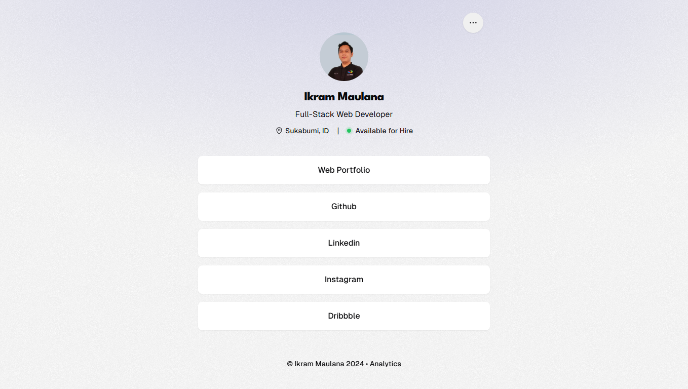

# Links

Discover the social media links of Ikram Maulana, a Full Stack Web Developer. Explore Ikram Maulana collection of projects and skills in web development



## Tech Stack

- Bun
- NextJS
- TailwindCSS
- tRPC
- HonoJS
- Clerk
- Drizzle
- MySQL
- ARCJet

## Feature

- Authentication
- Authorization
- Overview Data
- CRUD Social Media Links
- Link Click Logs

## Installation

1. Clone the repository

2. Install dependencies

   ```bash
   bun install
   ```

3. Run the project

   ```bash
   bun dev
   ```

4. Open [http://localhost:3000](http://localhost:3000) in your browser

5. Happy coding!
